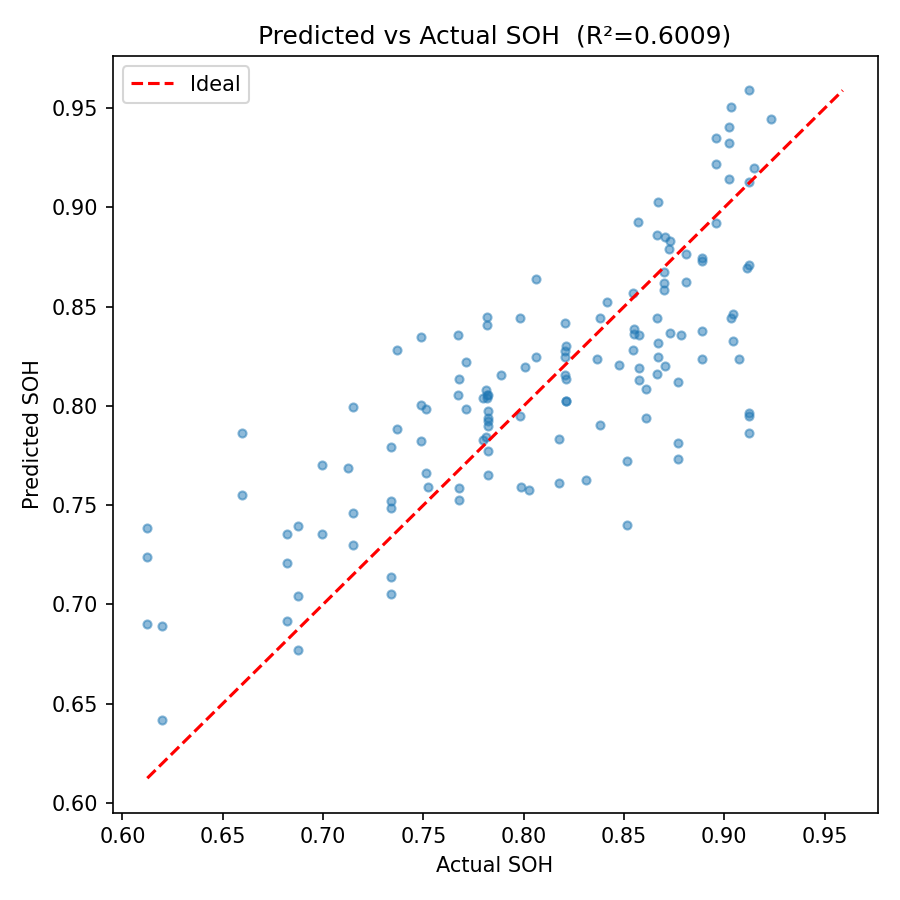

# Battery State of Health (SOH) Prediction

A machine learning pipeline that predicts the **State of Health (SOH)** of lithium-ion battery packs using Linear Regression. The model is trained on the [PulseBat dataset](https://www.sciencedirect.com/science/article/pii/S2352340922007284), which contains voltage measurements from individual battery cells.

## Overview

Battery SOH is a key metric in electric vehicles and energy storage systems — it indicates how much capacity a battery has retained relative to when it was new. This project builds an end-to-end ML pipeline to estimate pack-level SOH from cell voltage readings (U1–U21), and flags packs below a configurable health threshold.

## Pipeline

```
PulseBat Dataset (.xlsx)
        │
        ▼
data_preprocessing.py   →  Cleans & aggregates cell voltages, computes pack SOH
        │
        ▼
train_model.py          →  Scales features, trains Linear Regression, saves model
        │
        ▼
evaluate_model.py       →  Computes R², MSE, MAE, classification accuracy, generates plot
```

## Results

| Metric | Value |
|--------|-------|
| R² | 0.6009 |
| MSE | 0.0024 |
| MAE | 0.0382 |
| Classification Accuracy (threshold = 0.6) | 100% |



## Tech Stack

- **Python 3.8+**
- `scikit-learn` — Linear Regression, StandardScaler, train/test split
- `pandas` / `numpy` — data loading and preprocessing
- `matplotlib` — predicted vs. actual SOH visualization
- `joblib` — model serialization

## Getting Started

**1. Clone the repo and install dependencies**
```bash
git clone https://github.com/YOUR_USERNAME/battery-soh-prediction.git
cd battery-soh-prediction
pip install -r requirements.txt
```

**2. Preprocess the dataset**
```bash
python src/data_preprocessing.py --input "/path/to/PulseBat Dataset.xlsx" --output "./results/processed_data.csv"
```

**3. Train the model**
```bash
python src/train_model.py --input "./results/processed_data.csv" --model "./trained_model.pkl" --test-size 0.2 --random-seed 42 --threshold 0.6
```

**4. Evaluate and generate plots**
```bash
python src/evaluate_model.py --input "./results/processed_data.csv" --model "./trained_model.pkl" --test-size 0.2 --random-seed 42 --threshold 0.6
```

Outputs are saved to `results/`: metrics in `metrics.txt` and a predicted vs. actual scatter plot in `soh_predictions.png`.

## Project Structure

```
battery-soh-prediction/
├── src/
│   ├── data_preprocessing.py   # Loads Excel, detects U1–U21 columns, cleans and exports CSV
│   ├── train_model.py          # Trains Linear Regression model, saves model + scaler
│   └── evaluate_model.py       # Evaluates model, writes metrics, generates plot
├── results/
│   └── metrics.txt
├── requirements.txt
└── README.md
```

## Author

Zeyad Ghazal
